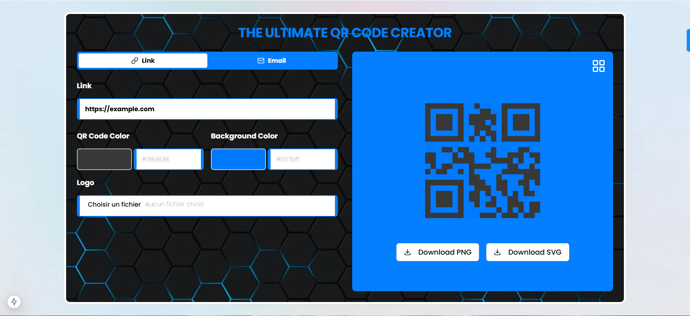

# **QR Code Generator**

Welcome to the **QR Code Generator**! This app allows users to create and customize QR codes for various purposes, including links, emails, and custom text, with features like color customization, logo insertion, and multiple download formats.



## **Visit the App:** [QR Code Generator](https://theultimateqrcodecreator.vercel.app/)

---

## **Table of Contents**

- [About the Project](#about-the-project)
- [Features](#features)
- [Technologies Used](#technologies-used)
- [Installation](#installation)
- [Usage](#usage)
- [Contact](#contact)

---

## **About the Project**

This project is a modern and user-friendly web application designed for creating customizable QR codes. Whether it's for sharing links, crafting email QR codes, or embedding plain text, this app provides an intuitive interface to generate professional-looking QR codes.

---

## **Features**

- **Multiple QR Code Types:**
  - **Links:** Create QR codes that redirect to a URL.
  - **Emails:** Generate QR codes for pre-filled email templates.
  - **Text:** Share custom text via QR codes.

- **Customization:**
  - Change foreground and background colors.
  - Add logos or images to the QR codes.
  - Real-time QR code preview.

- **Download Options:**
  - Save QR codes in **PNG** or **SVG** format.

- **Error Handling:**
  - Alerts for invalid URLs or empty inputs.

- **Responsive Design:**
  - Works seamlessly on any device, from desktops to smartphones.

---

## **Used Technologies**

- **Frontend:**
  - React.js
  - Next.js
  - Tailwind CSS

- **QR Code Library:**
  - qrcode.react

- **Utilities:**
  - FileSaver.js for downloading files.

---

## **Installation**

To set up the project locally, follow these steps:

1. **Clone the repository:**
   ```bash
   git clone https://github.com/khalid-tourhzaoui/QR-CODE-GENERATOR.git
   ```

2. **Navigate to the project directory:**
   ```bash
   cd QR-CODE-GENERATOR
   ```

3. **Install dependencies:**
   ```bash
   npm install
   ```

4. **Start the development server:**
   ```bash
   npm run dev
   ```

5. Open your browser and go to `http://localhost:3000` to view the project.


## **Contact**
- **Email:** [khalidtourhzaoui@gmail.com](mailto:khalidtourhzaoui@gmail.com)
- **LinkedIn :** [LinkedIn Profile](https://www.linkedin.com/in/khalid-tourhzaoui/)
- **My website:** [ Contact me](https://khalid-tourhzaoui.vercel.app/contactme)